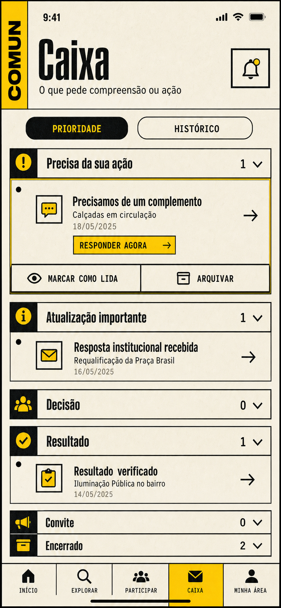

# Conceitos visuais — Tijolo 47.9A3

Os dois estudos foram gerados antes da implementação para ensaiar a continuidade
do Brutalismo Cívico Expressivo em jornadas curtas.

O conceito de confirmação definiu a hierarquia aplicada no componente canônico:
confirmação compacta, estado público, três respostas objetivas, ação primária de
acompanhamento, retorno nomeado e correção como ação terciária. A linha de etapas
do estudo não foi copiada: o produto explica explicitamente que revisão,
complemento, publicação e encerramento não formam um percurso obrigatório.

O conceito da Caixa orientou a separação entre prioridade e histórico, os grupos
funcionais, a origem visível, a leitura explícita e o CTA direto. A implementação
usa os tokens e componentes existentes do A2, em vez de reproduzir medidas ou
ornamentos do mockup.

## Fidelity ledger

| Decisão do conceito                                     | Implementação                                    | Estado                                    |
| ------------------------------------------------------- | ------------------------------------------------ | ----------------------------------------- |
| Confirmação responde o quê, privacidade e próximo passo | `ComunJourneyConfirmation`                       | preservada                                |
| Tracking é a ação dominante                             | CTA `Acompanhar participação`                    | preservada                                |
| Retorno possui destino nomeado                          | `Voltar à pauta` ou `Voltar à origem`            | preservada                                |
| Caixa agrupa por significado                            | seis grupos funcionais                           | preservada                                |
| Leitura não depende de viewport                         | forms explícitos lida/não lida                   | preservada                                |
| Histórico sai da prioridade                             | `?visao=historico`                               | preservada                                |
| Progresso linear na confirmação                         | substituído por explicação de ramificações reais | desvio intencional de segurança semântica |
| Conteúdo privado no mockup                              | nenhuma captura ou fixture privada é versionada  | desvio intencional de privacidade         |
