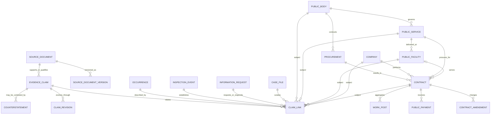
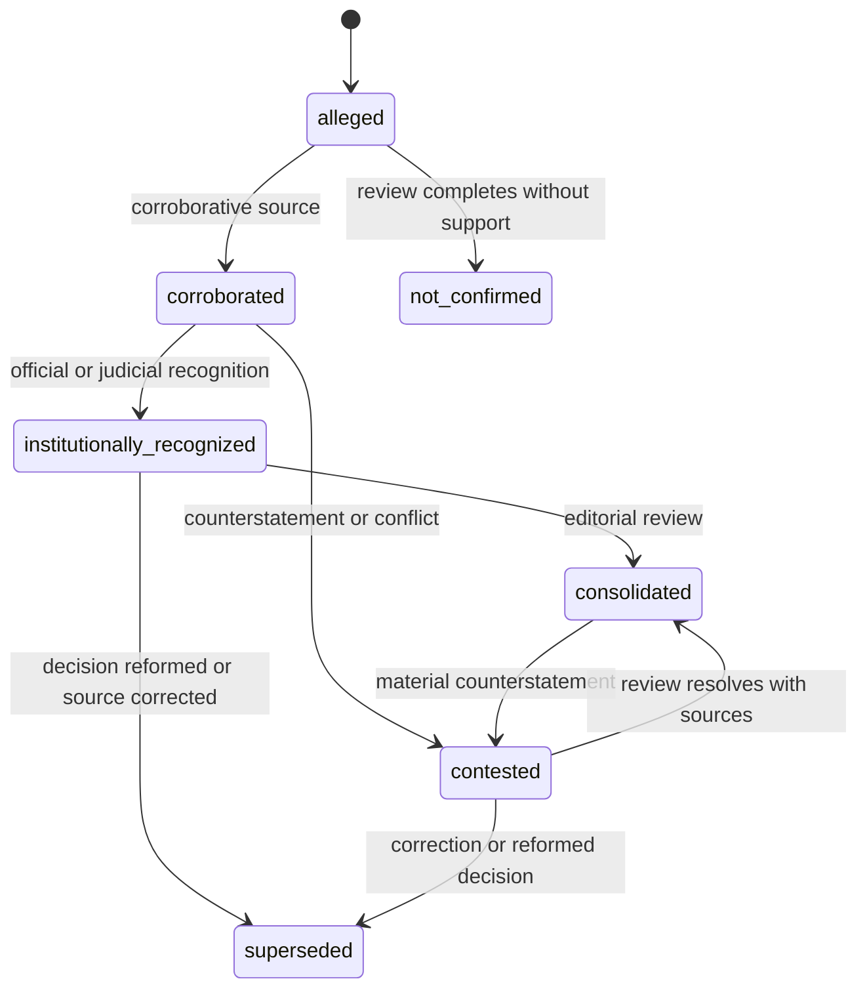

# Serviços Públicos e Controle Popular — ERD lógico SP-0

Related: #433 · Design only · No database schema is introduced here.

## Reading this model

Names below are logical entities, not approved physical table names. They
describe the smallest future graph that preserves provenance and uncertainty.
Every entity needs stable UUID identity, `created_at`, `updated_at`, an
import/editorial provenance field and a change/audit trail appropriate to its
classification.

The ERD is intentionally mediated by `CLAIM_LINK`: it prevents a source,
occurrence, contract or company from silently implying a legal or factual
relationship.

## Canonical service graph

| Logical entity | Minimal identity and fields | Classification | Key rule |
| --- | --- | --- | --- |
| PublicBody | legal name, jurisdiction, official identifiers, aliases | curatorial | A body can govern many services and conduct many procurements. |
| PublicService | name, domain, service type, coverage, operator model | curatorial/public after review | A service is distinct from the agency, facility and contractor. |
| PublicFacility | official name, public address/geometry, facility type, operating status | curatorial/public after review | Geometry may only use an independently public source. |
| Company | normalized CNPJ when known, legal/trade names, aliases, identity confidence | curatorial/public after review | A CNPJ is not inferred from a similar name; merge history remains auditable. |
| Procurement | procurement/process identifier, modality, public body, source | curatorial | A procurement may yield zero or more contracts. |
| Contract | instrument number, parties, service scope, start/end, original/current value, source confidence | curatorial/public after review | A contract is not proof that a company still operates a service. |
| ContractAmendment | amendment number/type, effective period, delta, source | curatorial | Never overwrite original contract terms. |
| PublicPayment | expense identifier, stage, amount, competence date, source | curatorial/public after review | Payment does not by itself prove proper service execution. |
| WorkPost | aggregate role, expected/known posts, period, source | curatorial | No worker name, contact, document or individual employment record. |

## Evidence and accountability graph

| Logical entity | Minimal fields | Classification | Key rule |
| --- | --- | --- | --- |
| SourceDocument | source URL/reference, issuer, publication date, retrieval time, hash, rights/access class | private/curatorial | Object bytes and signed URLs are separate from public metadata. |
| SourceDocumentVersion | immutable hash, revision relation, extraction metadata | private/curatorial | A corrected document gets a new version; history is preserved. |
| EvidenceClaim | normalized factual text, subject, temporal scope, evidence state, review state, public-safe wording | curatorial | Never encode an accusation as a boolean on Company or Contract. |
| ClaimRevision | before/after semantic status, editor/reviewer, reason, timestamp | private/curatorial | Enables correction, retraction, clarification and supersession. |
| ClaimLink | claim, subject entity, relation type, confidence, supporting source | curatorial | Contract/service attribution is explicit and independently evidenced. |
| Counterstatement | provenance, received date, response status, public-safe summary, linkage | private/curatorial | A counterstatement is not silently discarded or treated as a fact. |
| Occurrence | category, period, affected aggregate, status, source relationship | private/curatorial | A report/complaint is one possible source, not an automatic occurrence. |
| InspectionEvent | authority, event/date, measure/status, source | curatorial | Record notification, sanction and retention as distinct outcomes. |
| InformationRequest | channel, request date, deadline, response/review status, public summary | private/curatorial | Reuse existing protocol flow where appropriate; no raw response on public DTO. |
| CaseFile | editorial case identity, methodology, scope, review/publish state | curatorial | Groups evidence without changing source truth. |

## Claim state model

The state says what the evidence supports at a moment in time. It does not rank a
company or declare a legal conclusion outside the source's own scope.

## Existing COMUN joins

Future physical links should be optional junctions, not columns added to
unrelated legacy tables:

- `sp_pauta_links`: reviewed link from a service-graph entity or CaseFile to
  `comun_pauta_spaces`;
- `sp_action_links`: reviewed link to `comun_mobilization_actions`;
- `sp_protocol_links`: link to `comun_official_protocols`;
- `sp_report_links`: private-only provenance link to `comun_reports` or
  Relata cases;
- `sp_territory_links`: public facility/service coverage only; never private
  report coordinates.

No link has an automatic downstream side effect.