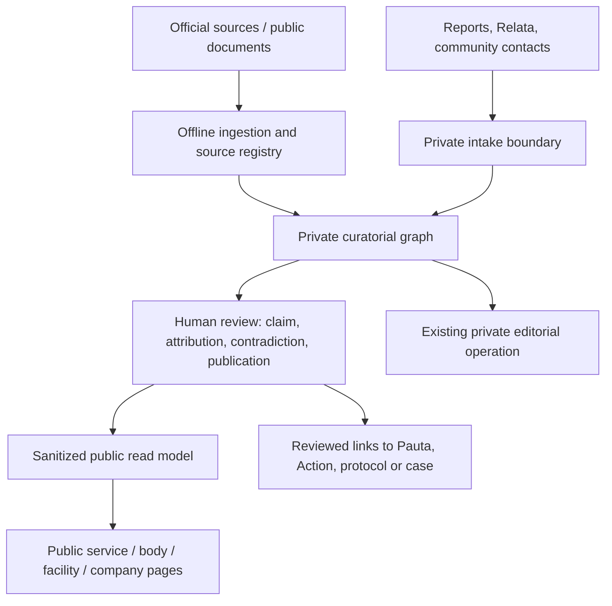

# Serviços Públicos e Controle Popular — boundary and threat model SP-0

Related: #433 · Extends, without replacing,
[`comun-security-data-threat-map.md`](./comun-security-data-threat-map.md).

## Trust boundaries

- **Public source boundary:** source availability does not make every field safe
  to republish; documents may contain personal data, signatures, minors,
  phone numbers, addresses or sensitive allegations.
- **Private intake boundary:** `comun_reports`, Relata cases, attachments,
  contacts, raw text and precise locations remain private inputs. SP is not a
  bypass for their consent, RLS or retention rules.
- **Curatorial boundary:** only authorized server-side reviewers can create,
  merge, link, revise, contest or publish a claim.
- **Publication boundary:** the public application reads only purpose-built,
  reviewed DTOs/read models. It cannot query base SP tables or dereference
  private documents.
- **Collective-action boundary:** Pauta, Action, protocol and official sending
  retain their own review/authorization. SP facts may inform them but cannot
  trigger them.
  Catalog entries for bodies/companies grant no representation, consent or
  editorial authority. InformationRequest/CaseFile reuse canonical protocols and
  dossiers with their existing review/publication boundaries.
- **Map boundary:** only publicly sourced facility geometry can reach a map.
  No report/Relata point, inferred residence, workplace or small-cell aggregate
  crosses it.

## Data classification

| Data | Default plane | May cross public boundary only when |
| --- | --- | --- |
| Public body, service, facility name and official address | curatorial | independently public, source cited and reviewed |
| Company CNPJ/legal name, contract number, official payment | curatorial | exact identity and document linkage are reviewed |
| Source object, OCR text, signatures, contact details, document metadata | private | never by default; publish a redacted derived excerpt only if reviewed |
| Claim, attribution and evidence status | curatorial | wording, temporal scope, source and state are reviewed |
| Labour occurrence | private/curatorial | aggregate, sourced, attributable only to the evidence level stated |
| Report/Relata data, location, identity, recovery/account data | private/highly sensitive | never through SP V1 |
| Editorial notes, reviewer identity, risk flags and queue status | private | never |
| Facility geometry | curatorial | sourced from official public reference, not user report location |

## Threats and controls

| Threat | Failure mode | Required control/evidence |
| --- | --- | --- |
| Defamatory compression | “company irregular” label hides allegation, date and outcome | claims with explicit state, source, time scope, counterstatement and correction history |
| Wrong entity resolution | similar company names or reused brand is merged incorrectly | normalized CNPJ where available, aliases, confidence, reviewer gate and reversible merge log |
| False contractual attribution | occurrence is assumed to belong to a municipal contract | explicit ClaimLink with source and confidence; “unknown/not established” remains valid |
| Sensitive-document leak | original PDF/OCR has PII or a signed URL enters HTML | private object storage, redaction derivative, column allowlists and HTTP no-leak regression |
| Private-location linkage | facility map reveals reporter/workplace location | facility geometry accepted only from independent public source; no geometry copied from reports |
| RLS/grant bypass | public client reads base tables, RPCs or views | RLS/FORCE RLS, explicit grants, `security_invoker` for public views, negative anon/auth tests |
| IDOR in curation | reviewer manipulates another team/case by UUID | server-derived identity, role/scope checks and audit records independent of client IDs |
| Source tampering or drift | changed page silently changes evidence | source version hash, retrieval timestamp, immutable version relation and re-review after material drift |
| Stale public claim | contract ends, decision changes or correction arrives | validity interval, source monitoring, “last reviewed” and superseded/reformed state |
| Unreviewed automation | ETL/monitor creates accusation, Pauta or official action | ingestion is quarantine-only; no public publish or downstream action without human gate |
| Contradictory evidence erased | correction/defense is overwritten or hidden | Counterstatement and ClaimRevision entities; public status reflects unresolved conflict where needed |
| Individual worker exposure | names/contacts become a workforce dataset | aggregate WorkPost only; privacy review for any future exception |
| Search/cache overexposure | sanitized page caches a withdrawn item | publication snapshot/read-model version, cache invalidation and withdraw/despublish smoke |
| Cross-domain semantic collision | `comun_actions` mistaken for organized Action | explicit adapters; preserve legacy semantics and use `comun_mobilization_actions` for collective action |

## Non-negotiable security properties for SP-1+

1. Base SP tables, private source objects and review queues are
   `service_role_only` or an equivalent narrowly scoped server interface.
2. Every public DTO is field-allowlisted and tested against a denylist:
   raw/OCR text, personal data, private notes, storage paths, signed URLs,
   internal identifiers, exact private location and reviewer data.
3. Every mutation is idempotent where retried, append-audited and derives actor
   identity server-side.
4. A public claim requires a public-safe wording, cited source, temporal scope,
   evidence state and publication review. Absence of evidence never serializes
   as “regular”.
5. Withdrawal, correction and reformation are tested as ordinary paths, not
   exceptional manual SQL.
6. No SP migration obtains a Production write through documentation work; any
   later remote change follows the repository's forward-only promotion gate.

## Required test classes before public read models

- RLS/grant matrix: anon/authenticated cannot read or mutate base/case/source
  data; authorized service path can perform only scoped operations.
  Use populated synthetic fixtures and distinct actors A/B, anonymous, ordinary,
  scoped reviewer and out-of-scope reviewer. Check grants separately: a missing
  GRANT or empty table does not demonstrate RLS. Service-role application scope
  checks must precede privileged client creation and reject swapped identifiers.
  Run on an owned local disposable stack or isolated Linux-runner ephemeral
  stack with synthetic data and no remote Production credentials; cleanup only
  owned fixtures/stack. No real remote service substitutes for unavailable Docker.
- no-leak DTO/HTTP tests: prohibited fields never appear in HTML, JSON, search,
  metadata, sitemap, logs or error messages.
- entity-resolution tests: duplicates and uncertain aliases do not silently
  merge.
- claim lifecycle tests: corroborate, contest, correct, supersede and withdraw.
- source-version tests: changed source creates a new version and flags dependent
  claims for review.
  Prove N:N revision-to-source-version citations with role and locator, including
  contradictory sources; do not mutate the citations of an older revision.
- attribution tests: a company/contract link cannot be created without
  provenance and confidence.
- map tests: only public facility geometry is emitted; no report/Relata
  coordinates are queried.
- non-automation tests: ingestion and alerts create no public claim, Pauta,
  Action, protocol send or representation.

## Semantic adversarial cases

| Input or shortcut | Required rejection or preserved distinction |
| --- | --- |
| Same bidding number/year from different issuers | Identity includes issuer/jurisdiction/modality and sourced process identity; no global-number merge. |
| Administrative quantity presented as workers served | Preserve unit and period; quantity is not a count of people. |
| ARP presented as money spent | Price registration is distinct from commitment, liquidation and payment. |
| Valid contract or last-known supplier | Neither proves present execution; require dated execution evidence. |
| Public PDF with signatures, contacts or minors | Review/redact; public availability does not authorize indiscriminate republication. |
| Search returns no document | Record search date, locations and scope; “not located” is not nonexistence. |
| Editorial approval presented as final judgment | Keep evidence, publication and procedural instance/outcome/finality independent; publish contested wording only as contested. |
| One facility or contract forced into a single branch | Preserve multi-service/multiunit or non-point coverage, temporal responsibility and source provenance. |

Research-chat assertions are leads, not primary sources. Until a document/version,
locator, period and scope are recorded, examples are explicitly synthetic. The
first future Merenda case and later Cuidadores coverage/privacy review add no
portal, route or Production work in SP-0.

## Remaining limitations

SP-0 cannot resolve legal interpretation, incomplete transparency portals,
source bias or the staffing cost of human review. The mitigation is disciplined
disclosure: describe exactly what a source supports, preserve uncertainty and
publish correction paths, rather than infer a definitive ranking.
